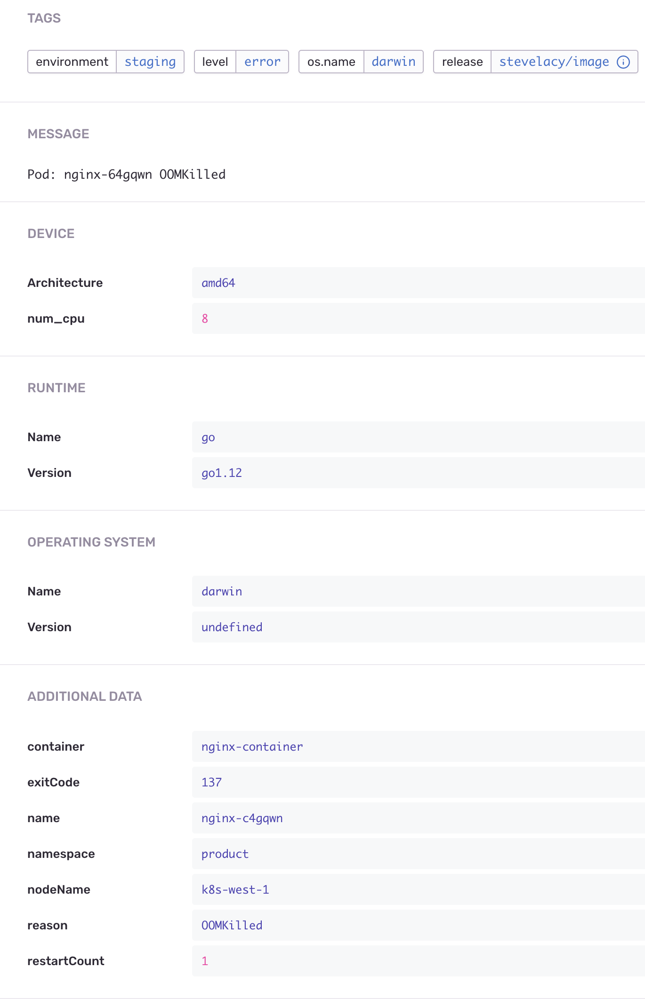

# go-sentry-kubernetes

> Sentry.io reporting client for kubernetes


The official [sentry-kubernetes](https://github.com/getsentry/sentry-kubernetes) is written in python and has a major memory leak and is [not officially maintained by Sentry](https://github.com/getsentry/sentry-kubernetes/issues/42). This reporter is written in golang and uses less than 10MB ram.

## Install

> Create a new project on Sentry and use your project DSN

Running from cli:

```sh
kubectl run go-sentry-kubernetes \
  --image stevelacy/go-sentry-kubernetes \
  --env="DSN=$YOUR_DSN"
```

Installing as a deployment:

Save as `deployment.yaml`

```yaml
---
apiVersion: apps/v1
kind: Deployment
metadata:
  name: sentry
spec:
  replicas: 1
  selector:
    matchLabels:
      name: sentry
  template:
    metadata:
      labels:
        name: sentry
    spec:
      # required if you make use of rbac
      serviceAccountName: sentry
      containers:
      - name: sentry
        env:
        - name: DSN
          value: "$SENTRY_DSN"
        - name: ENV
          value: "production"
        image: stevelacy/go-sentry-kubernetes:latest
        resources:
          limits:
            memory: "50M"
            cpu: "0.15"
          requests:
            cpu: "0.1"
            memory: "20M"
# required if you make use of rbac
---
apiVersion: rbac.authorization.k8s.io/v1beta1
kind: ClusterRole
metadata:
  name: sentry
rules:
- apiGroups:
  - ""
  resources:
  - events
  - pods
  verbs:
  - get
  - list
  - watch
---
apiVersion: rbac.authorization.k8s.io/v1beta1
kind: ClusterRoleBinding
metadata:
  name: sentry
roleRef:
  apiGroup: rbac.authorization.k8s.io
  kind: ClusterRole
  name: sentry
subjects:
- kind: ServiceAccount
  name: sentry
  namespace: monitoring
---
apiVersion: v1
kind: ServiceAccount
metadata:
  name: sentry
  namespace: monitoring
```

`$ kubectl apply -f ./deployment.yaml`

Set the `--debug` flag to enable debug logs:

```yaml
      containers:
      - name: go-sentry-kubernetes
        args:
        - --debug
        command:
        - /app/main
        image: stevelacy/go-sentry-kubernetes
```



[MIT](LICENSE)
